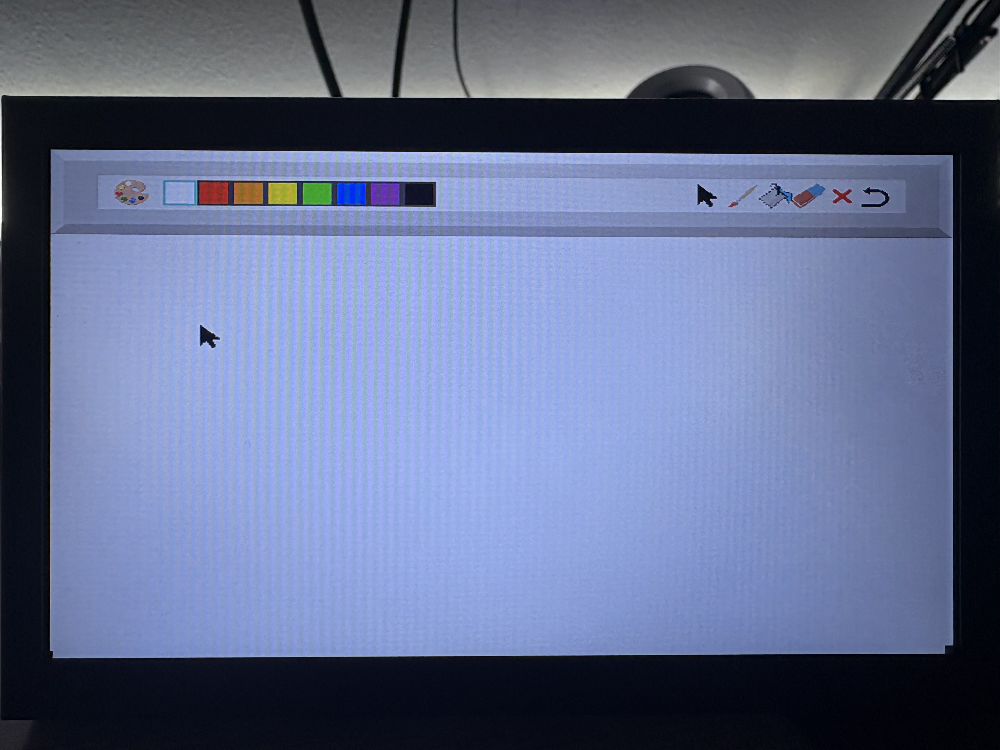
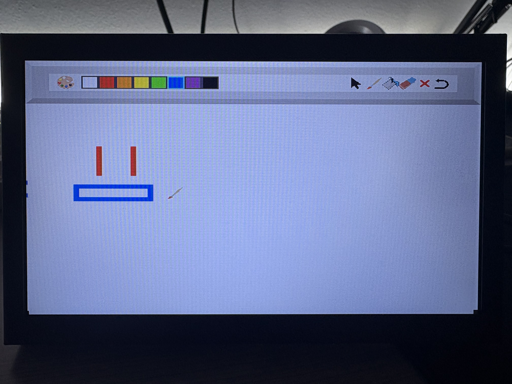
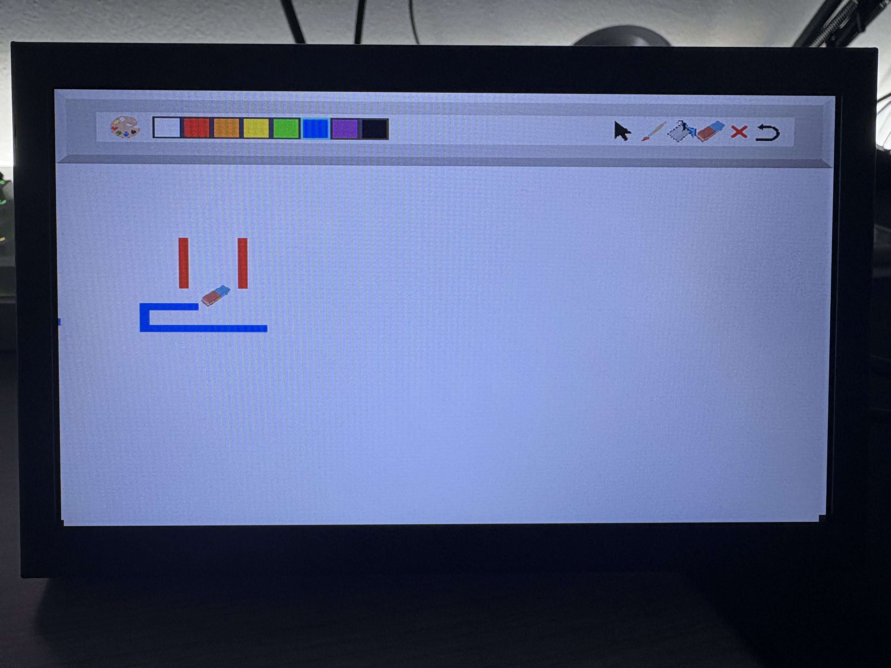
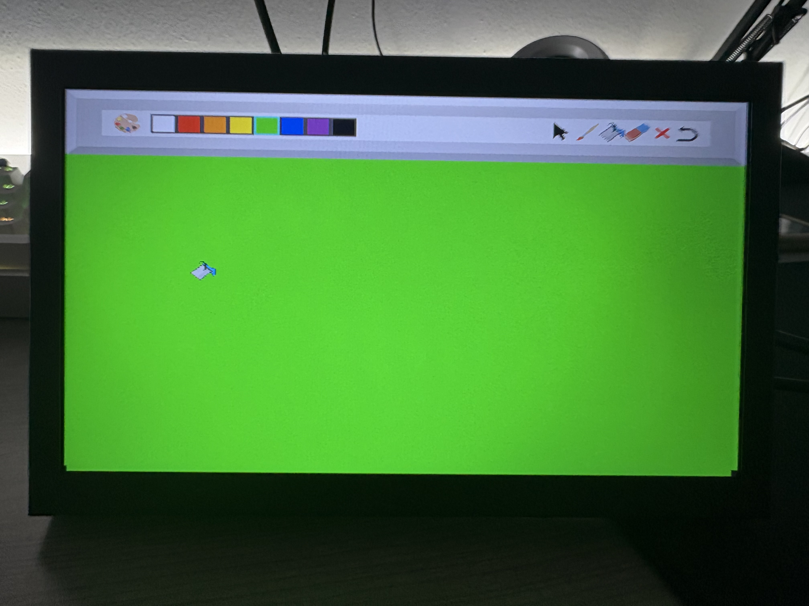
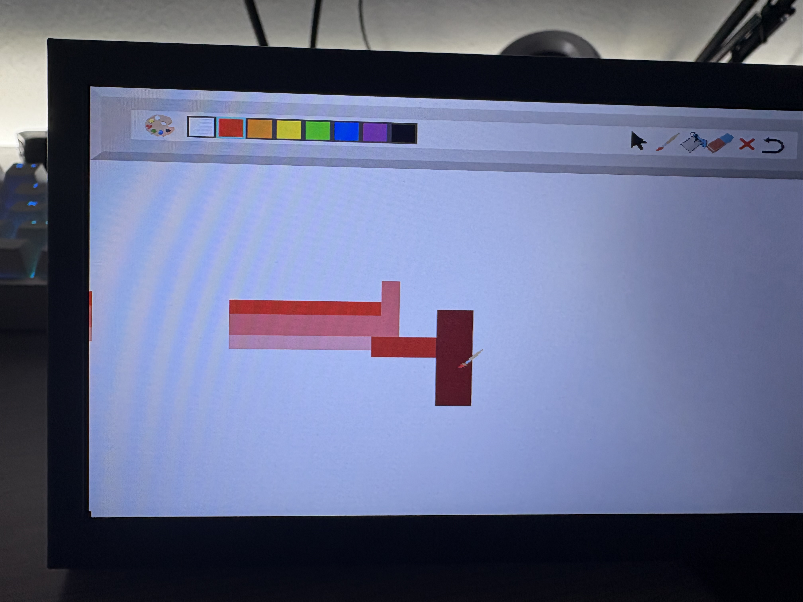

# 🎨 FPGA Pixel Art Drawer (VGA Output)

A real-time pixel-art drawing tool implemented in Verilog, designed for FPGA platforms with VGA output. Features include a cursor-based interface, brush/eraser tools, color palette, fill/clear functionality, and brightness adjustment.

## 🚀 Features

- **VGA Display (640×480)**: Interactive canvas with 8×8 pixel cells (80×50 grid)
- **Drawing Tools**:  
  - Cursor  
  - Brush  
  - Eraser  
  - Fill (entire canvas)  
- **User Input**:  
  - 4 pushbuttons for cursor movement  
  - Switches for tool selection, color choice, brightness, and clear  
- **Color Control**:  
  - RGB color selection via switches  
  - Brightness up/down control  
  - Colors palette (8-slots)  
- **Toolbar UI**:  
  - On-screen icons for tools and color selection  
  - Visual cursor feedback  
- **Memory-Efficient Design**:  
  - Separate triple-port RAMs for red, green, and blue channels  
  - Custom ROM sprites for tools and UI elements  
- **Debounced Input with Auto-Repeat**: Smooth and responsive controls for movement

## 📦 Modules Overview

| Module | Description |
|--------|-------------|
| `pixelart_top` | Top-level module integrating VGA, logic, input, and RAM |
| `vga_controller` | Handles VGA timing, sync, and blanking |
| `pattern_generator` | Main FSM and pixel renderer; interprets tools and input |
| `pointer_object` | Handles cursor movement logic and bounding |
| `pointer_pos` | Calculates sprite offset for tool rendering |
| `keypress` | Debounces and manages button input with repeat timing |
| `recent_colors` | 8-slot FIFO-like palette memory for latest used colors |

## 🎮 Controls

| Input | Function |
|-------|----------|
| `KEY[3:0]` | Move cursor (L, D, U, R) |
| `SW[0]` | Click (apply tool) |
| `SW[2:1]` | Tool Select: `00`=Cursor, `01`=Brush, `10`=Eraser, `11`=Fill |
| `SW[5:3]` | RGB base color selector |
| `SW[6]` | Clear canvas |
| `SW[7]` | Brightness up |
| `SW[8]` | Brightness down |

## 🧠 FSM States

- `INIT_CLEAR`: Fills canvas with white on reset
- `NORMAL_OPERATION`: Applies tool at pointer on click
- `FILL_OPERATION`: Fills entire canvas with selected color
- `CLEAR_CANVAS`: Resets canvas to white

## 🧩 Requirements

- FPGA Board (DE1-SoC or equivalent with VGA output)
- VGA Monitor
- Quartus Prime / ModelSim / Questa

## 📸 Preview  

*Startup Screen*

*Brush Applied / in Hand*

*Eraser Applied / in Hand*

*Fill Applied / in Hand*

*Clear Applied*

*Color Brightness Example*
